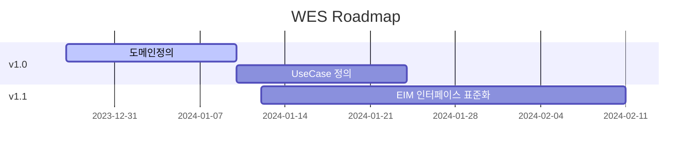

# Roadmap

```mermaid
gantt
    title WES Roadmap
    dateFormat YYYY-MM-DD
    section v1.0
        도메인정의: active, t1, 2023-12-27, 14d
        UseCase 정의: after t1, 14d
    
    section v1.1
        EIM 인터페이스 표준화 :2024-01-12, 30d
```
## v1.0
### 도메인 정의
- Context Boundary, Root 정의
- 도메인별 기능 정의

### UseCase 정의
- TBD

## v1.1
> TBD
